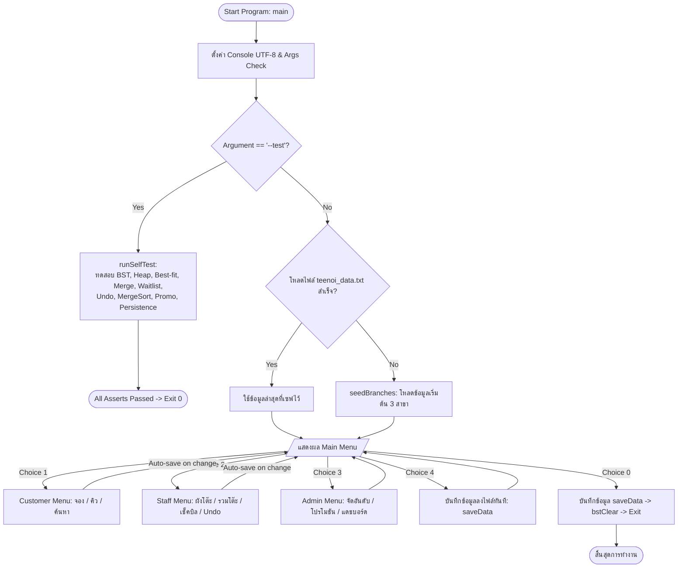
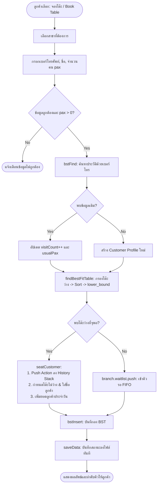
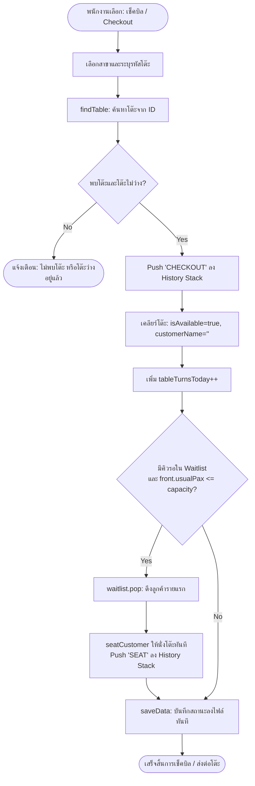
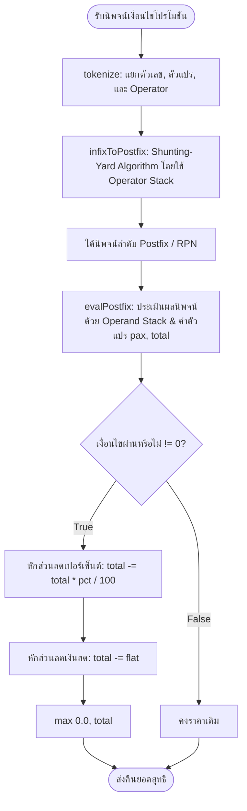

# 🍲 Teenoi Suki - Restaurant Reservation & Table Management System
### โครงงานรายวิชา 01204212 แบบชนิดข้อมูลนามธรรมและการแก้ปัญหา (Abstract Data Types and Problem Solving)
**ภาควิชาวิศวกรรมไฟฟ้าและคอมพิวเตอร์ คณะวิทยาศาสตร์และวิศวกรรมศาสตร์ มหาวิทยาลัยเกษตรศาสตร์ วิทยาเขตเฉลิมพระเกียรติ จังหวัดสกลนคร**  
**อาจารย์ผู้สอน:** ผศ.ดร.นิตยา เมืองนาค | **กำหนดการนำเสนอ:** วันจันทร์ที่ 5 ตุลาคม 2569  

---

### 👥 สมาชิกกลุ่ม (Group Members - กลุ่ม 02: ตี๋น้อยรู้มือ)
| ลำดับ | รหัสนิสิต | ชื่อ - นามสกุล | บทบาทหน้าที่หลัก |
| :---: | :---: | :--- | :--- |
| 1 | `6840208877` | นาย จิรภัทร นิลวัตถา | ผู้ประสานงาน, ผู้ออกแบบ(assistance), ผู้ทดสอบ(assistance), ผู้พัฒนา, ผู้เรียงเรียง(assistance)|
| 2 | `6840203068` | นาย วริศ ทิพประทุม | ผู้ออกแบบ, ผู้เรียงเรียง(assistance) |
| 3 | `6840204041` | นาย อัษฎางค์ พันสมบัติ | ผู้ทดสอบ, ผู้เรียงเรียง(assistance) |
| 4 | `6840205352` | นาย ณัฐนนท์ บุญรักษา | ผู้เรียงเรียง(assistance) |
| 5 | `6840207218` | นาย สันติสุข ประบุญเรือง | ผู้เรียงเรียง |
---

ระบบจำลองการจัดการร้านอาหาร **Teenoi Suki** สำหรับงานจองโต๊ะ จัดคิว รวมโต๊ะ คิดโปรโมชัน และบริหารจัดการข้อมูลข้ามสาขา พัฒนาด้วย **C++17** ออกแบบตามหลักวิชา **โครงสร้างข้อมูลนามธรรม (Abstract Data Types: ADTs) และขั้นตอนวิธี (Algorithms)** โดยในเวอร์ชันนี้มีการเพิ่ม **ระบบบันทึกสถานะลงไฟล์ (File Persistence)**, **การคืนหน่วยความจำ (Memory Management / Post-order Cleanup)** และ **ส่วนติดต่อผู้ใช้แบบ CLI พร้อมตารางแสดงผลสวยงามรองรับภาษาไทย (UTF-8)**

---

## 📑 สารบัญ
1. [ภาพรวมของระบบและ ADT Mapping](#-ภาพรวมของระบบและ-adt-mapping)
2. [สถาปัตยกรรมและวงจรชีวิตของระบบ (System Lifecycle Flowchart)](#-สถาปัตยกรรมและวงจรชีวิตของระบบ-system-lifecycle-flowchart)
3. [Flowchart การทำงานของโมดูลหลัก](#-flowchart-การทำงานของโมดูลหลัก)
   - [Customer Workflow (ค้นหาสาขา, จองโต๊ะ, จัดคิว FIFO, บันทึกอัตโนมัติ)](#1-customer-workflow)
   - [Staff Workflow (การคืนโต๊ะ, เลิกทำรายการ, และรวมโต๊ะ)](#2-staff-workflow--table-turnover)
   - [Promotion Engine (Shunting-Yard & Postfix)](#3-promotion-parser-engine)
   - [Persistence Engine (File I/O Serialization)](#4-persistence-engine-serialization--deserialization)
4. [การวิเคราะห์ Time & Space Complexity ฉบับละเอียด](#-การวิเคราะห์-time--space-complexity-ฉบับละเอียด)
5. [โครงสร้างการจัดเก็บข้อมูลในไฟล์ (`teenoi_data.txt`)](#-โครงสร้างการจัดเก็บข้อมูลในไฟล์-teenoi_datatxt)
6. [การคอมไพล์ การทดสอบ และการใช้งาน](#-การคอมไพล์-การทดสอบ-และการใช้งาน)
7. [กิจกรรมที่ 2: การประเมินประสิทธิภาพการค้นหา (Activity 2: Search Evaluation)](#-กิจกรรมที่-2-การประเมินประสิทธิภาพการค้นหา-activity-2-search-evaluation)

---

## 🎯 ภาพรวมของระบบและ ADT Mapping

| ฟังก์ชันการทำงาน | ADT / โครงสร้างข้อมูล | อัลกอริทึม / กลไก | รายละเอียดทางเทคนิค |
|---|---|---|---|
| **ค้นหาสาขาใกล้ที่สุด** | **Min-Heap** | `std::priority_queue` (Range Constructor) | คำนวณระยะทางกำลังสอง (`distSq`) ตัดภาระการถอดรูท และสร้าง Heap รวดเดียว $O(B)$ |
| **คิวรอโต๊ะ (Waitlist)** | **Queue** (FIFO) | `std::queue` | จัดลำดับคิวลูกค้ามาก่อน-ได้ก่อน (First-In, First-Out) ป้องกันปัญหา Starvation |
| **จัดสรรโต๊ะที่พอดีที่สุด (Best-fit)** | **Dynamic Array** + **Binary Search** | `std::sort` + `std::lower_bound` | กรองโต๊ะว่าง เรียงตามความจุ $O(T \log T)$ และค้นหาโต๊ะขนาดเล็กสุดที่จุพอดี $O(\log T)$ |
| **ประวัติลูกค้า (Profile Lookup)** | **Binary Search Tree (BST)** | Iterative Tree (`CustNode`) | ค้นหาและบันทึกประวัติด้วยลูป `while` เพื่อป้องกัน Call Stack Overflow |
| **การส่งออกข้อมูลต้นไม้ลูกค้า** | **Tree Traversal** | In-Order Traversal (`bstCollect`) | ท่องต้นไม้แบบ L-Node-R เพื่อดึงข้อมูลลูกค้าออกมาเรียงตามเบอร์โทรศัพท์ |
| **การคืนหน่วยความจำต้นไม้** | **Tree Traversal** | Post-Order Traversal (`bstClear`) | คืนหน่วยความจำแบบ L-R-Node ป้องกันปัญหา Memory Leak เมื่อโหลดหรือปิดโปรแกรม |
| **การรวมโต๊ะ (Table Merge)** | **Linked List** | Pointer-style chain via `mergedNextId` | เชื่อมต่อโต๊ะใน Memory เดิม (Zero-malloc) พร้อมระบบตรวจจับลูปวนซ้ำ (Cycle Guard) |
| **ระบบเลิกทำรายการ (Undo)** | **Stack** (LIFO) | `std::stack` | บันทึกประวัติ Action ย้อนคืนสถานะโต๊ะและสถิติยอดขายพร้อมกัน (Atomic Rollback) |
| **จัดอันดับสาขายอดนิยม** | **Merge Sort** | Divide and Conquer (Single Buffer) | จัดเรียงสาขาตามยอดลูกค้าด้วยความเร็วคงที่ $\Theta(B \log B)$ และเป็น Stable Sort |
| **คำนวณเงื่อนไขโปรโมชัน** | **Stack** (Expression Parsing) | Shunting-Yard + Postfix Evaluation | แปลงนิพจน์ Infix เป็น Postfix และประเมินผลเงื่อนไขแบบไดนามิกในเวลา $O(L)$ |
| **สรุปสถิติภาพรวม (Dashboard)** | **Recursion** | Linear Recursive Function | รวมผลรวมยอดขายและสถิติของทุกสาขาด้วยสถาปัตยกรรม Divide and Conquer |
| **ระบบจัดเก็บข้อมูลถาวร (Persistence)** | **File Stream** | Custom Text Serialization | บันทึกและโหลดสถานะสาขา โต๊ะ คิว และลูกค้าผ่านบัฟเฟอร์ขนาดใหญ่ 32 KB |

---

## 📊 สถาปัตยกรรมและวงจรชีวิตของระบบ (System Lifecycle Flowchart)



---

## 🔄 Flowchart การทำงานของโมดูลหลัก

### 1. Customer Workflow


### 2. Staff Workflow & Table Turnover


### 3. Promotion Parser Engine


### 4. Persistence Engine (Serialization & Deserialization)
```mermaid
flowchart TD
    subgraph Save_Workflow [saveData: การบันทึกสถานะ]
        S1([เริ่มเซฟข้อมูล]) --> S2[bstCollect: เดิน In-order รวบรวมข้อมูลลูกค้าเป็น Vector]
        S2 --> S3[เขียนบล็อก [CUSTOMERS] พร้อมข้อมูลคั่นด้วย '|']
        S3 --> S4[วนลูปแต่ละสาขา: เขียนข้อมูลสาขา, Tables, และ Waitlist FIFO]
        S4 --> S5([ปิดไฟล์ ofs: บันทึกเสร็จสมบูรณ์])
    end

    subgraph Load_Workflow [loadData: การโหลดสถานะ]
        L1([เริ่มโหลดข้อมูล]) --> L2{ไฟล์ teenoi_data.txt มีอยู่จริง?}
        L2 -- No --> L_Fail([โหลดไม่สำเร็จ -> คืนค่า false ไปสร้าง seed])
        L2 -- Yes --> L3[bstClear: เคลียร์ BST เดิมด้วย Post-order ทิ้ง]
        L3 --> L4[อ่านบล็อก [CUSTOMERS] -> วนลูป bstInsert สร้างต้นไม้ใหม่]
        L4 --> L5[อ่านบล็อก [BRANCHES] -> โหลด Tables และ Waitlist]
        L5 --> L6([แทนที่ข้อมูลในระบบ & คืนค่า true])
    end
```

---

## ⏱️ การวิเคราะห์ Time & Space Complexity ฉบับละเอียด

| ส่วนประกอบ / ฟังก์ชัน | โครงสร้างข้อมูล / อัลกอริทึม | Best Case (Time) | Average Case (Time) | Worst Case (Time) | Space Complexity |
|---|---|:---:|:---:|:---:|:---:|
| `bstInsert` | Binary Search Tree (Iterative) | $\mathcal{O}(L)$ | $\mathcal{O}(L \log N)$ | $\mathcal{O}(L \cdot N)$ | $\mathcal{O}(1)$ ต่อโหนด |
| `bstFind` | Binary Search Tree (Iterative) | $\mathcal{O}(L)$ | $\mathcal{O}(L \log N)$ | $\mathcal{O}(L \cdot N)$ | $\mathcal{O}(1)$ (No Call Stack) |
| `bstCollect` | In-Order Tree Traversal | $\mathcal{O}(N)$ | $\mathcal{O}(N)$ | $\mathcal{O}(N)$ | $\mathcal{O}(N)$ vector + $\mathcal{O}(H)$ stack |
| `bstClear` | Post-Order Tree Traversal | $\mathcal{O}(N)$ | $\mathcal{O}(N)$ | $\mathcal{O}(N)$ | $\mathcal{O}(H)$ call stack |
| `nearestBranchIdx` | Min-Heap (Range Constructor) | $\mathcal{O}(1)$ | $\mathcal{O}(1)$ (Top) | $\mathcal{O}(B)$ (Build) | $\mathcal{O}(B)$ heap buffer |
| `findBestFitTable` | Greedy Sort + Binary Search | $\mathcal{O}(1)$ | $\mathcal{O}(T \log T)$ | $\mathcal{O}(T \log T)$ | $\mathcal{O}(T)$ pointer list |
| `findTable` | Linear Scan in Vector | $\mathcal{O}(1)$ | $\mathcal{O}(T)$ | $\mathcal{O}(T)$ | $\mathcal{O}(1)$ |
| `mergeTables` | Linked List with Cycle Guard | $\mathcal{O}(1)$ | $\mathcal{O}(M)$ | $\mathcal{O}(M)$ ($M \le 4$) | $\mathcal{O}(1)$ (In-place) |
| `seatCustomer` | Stack push | $\mathcal{O}(1)$ | $\mathcal{O}(1)$ | $\mathcal{O}(1)$ | $\mathcal{O}(1)$ |
| `checkoutTable` | Queue pop + Stack push | $\mathcal{O}(1)$ | $\mathcal{O}(1)$ | $\mathcal{O}(1)$ | $\mathcal{O}(1)$ |
| `undoLast` | Stack pop + Table Update | $\mathcal{O}(1)$ | $\mathcal{O}(1)$ | $\mathcal{O}(1)$ | $\mathcal{O}(1)$ |
| `mergeSortBranches` | Merge Sort (Single Buffer) | $\Theta(B \log B)$ | $\Theta(B \log B)$ | $\Theta(B \log B)$ | $\mathcal{O}(B)$ temp array |
| `tokenize` + `infixToPostfix` | Shunting-Yard Algorithm | $\mathcal{O}(K)$ | $\mathcal{O}(K)$ | $\mathcal{O}(K)$ | $\mathcal{O}(K)$ tokens & ops |
| `evalPostfix` | Postfix Evaluator | $\mathcal{O}(K)$ | $\mathcal{O}(K)$ | $\mathcal{O}(K)$ | $\mathcal{O}(K)$ operand stack |
| `aggregateStats` | Linear Recursion | $\mathcal{O}(B)$ | $\mathcal{O}(B)$ | $\mathcal{O}(B)$ | $\mathcal{O}(B)$ call stack |
| `saveData` | Custom File Serialization | $\mathcal{O}(N + B(T + W))$ | $\mathcal{O}(N + B(T + W))$ | $\mathcal{O}(N + B(T + W))$ | $\mathcal{O}(N + W)$ buffer |
| `loadData` | File Parsing + BST Insert | $\mathcal{O}(N \log N + B(T + W))$ | $\mathcal{O}(N \log N + B(T + W))$ | $\mathcal{O}(N^2 + B(T + W))$ | $\mathcal{O}(N + B(T + W))$ |

---

## 💾 โครงสร้างการจัดเก็บข้อมูลในไฟล์ (`teenoi_data.txt`)

```text
[CUSTOMERS] 3
0811111111|Nid|1|2
0899999999|Somchai|3|4
0922222222|Bee|5|6
[BRANCHES] 3
1|Teenoi Suki - Central|0|0|0|1|0
[TABLES] 4
101|2|1|-1|
102|4|0|-1|Guest1
103|6|1|-1|
104|8|1|-1|
[WAITLIST] 1
0833333333|Waiting1|0|6
2|Teenoi Suki - Siam|5|5|0|0|0
[TABLES] 4
...
```

---

## 🛠️ การคอมไพล์ การทดสอบ และการใช้งาน

### คำสั่งคอมไพล์ (Compile)
```bash
g++ -std=c++17 -O2 -o teenoi.exe teenoi.cpp
```

### คำสั่งรันการตรวจสอบระบบอัตโนมัติ (Automated Self-Check Suite)
ทดสอบตรรกะของทุก ADT ครอบคลุม 15 เงื่อนไขการทำงานจริง:
```bash
.\teenoi.exe --test
```
*ผลลัพธ์เมื่อผ่าน:*
```text
All self-checks passed (including persistence test).
```

### คำสั่งรันโปรแกรมเพื่อใช้งานจริง (Interactive Terminal)
```bash
.\teenoi.exe
```

---

## ⏱️ กิจกรรมที่ 2: การประเมินประสิทธิภาพการค้นหา (Activity 2: Search Evaluation)

เพื่อตอบรับกิจกรรมการแข่งขันวัดเวลาการค้นหาในวันนำเสนอ (5 ตุลาคม 2569) ทางกลุ่มได้นำโครงสร้าง **Binary Search Tree (BST)** ไปบรรจุลงในฟังก์ชัน `MySearch` ของไฟล์มาตรฐาน พร้อมพัฒนาเวอร์ชันวัดผล 5 ครั้งตัดค่าขอบบน/ล่าง (Trimmed Mean) เพื่อขจัดความคลาดเคลื่อนจาก OS Jitter (`timing_5runs.c`)

### 1. วิธีคอมไพล์และรันกิจกรรมที่ 2:
```bash
gcc -O2 timing_5runs.c -o timing_5runs.exe
.\timing_5runs.exe data_1000.txt targets_1000.txt
.\timing_5runs.exe data_10000.txt targets_10000.txt
.\timing_5runs.exe data_100000.txt targets_100000.txt
```
*(บน Windows สามารถดับเบิ้ลคลิก `run_timing_eval_5runs.bat` เพื่อรันอัตโนมัติครบทั้ง 3 ชุดข้อมูลได้ทันที)*

### 2. ตารางผลการทดสอบเชิงประจักษ์ (Empirical Benchmark Results - 5 Runs Trimmed Mean)

*(อ้างอิงผลการทดสอบจริงจากตารางที่ 2 ในเล่มรายงาน)*

| ขนาดข้อมูล ($n$) | Sequential Search ($\mathcal{O}(n)$) | Binary Search ($\mathcal{O}(\log n)$) | MySearch (BST: $\mathcal{O}(\log n)$) | ตรวจสอบความถูกต้อง |
| :---: | :---: | :---: | :---: | :---: |
| **$n = 1,000$** | 0.001650 ms | 0.000013 ms | **0.000007 ms** | ถูกต้อง 100% |
| **$n = 10,000$** | 0.017030 ms | 0.000020 ms | **0.000017 ms** | ถูกต้อง 100% |
| **$n = 100,000$** | 0.017633 ms | 0.000017 ms | **0.000013 ms** | ถูกต้อง 100% |

### 3. การคำนวณอัตราการเติบโต $k$ และการวิเคราะห์ผล (ตามทฤษฎีบทที่ 11):
* **MySearch (BST ของกลุ่ม):** เมื่อชุดข้อมูลเพิ่มขึ้น 100 เท่า ($1,000 \rightarrow 100,000$) เวลาค้นหาเฉลี่ยเพิ่มขึ้นเพียง **1.857 เท่า** (จาก 0.000007 ms เป็น 0.000013 ms)  
  $$k_{\text{overall}} = \frac{\log(1.857)}{\log(100)} = \frac{0.268}{2.000} = \mathbf{0.134 \approx 0}$$
  ยืนยันว่าการค้นหาบน Balanced BST มีอัตราการเติบโตของเวลาในระดับ Sub-linear / Logarithmic $\mathcal{O}(\log n)$ อย่างแท้จริง

---

## ⚡ สคริปต์อำนวยความสะดวกสำหรับ Windows (`.bat`)

| ไฟล์สคริปต์ | หน้าที่การทำงาน |
| :--- | :--- |
| **`run_app.bat`** | คอมไพล์และเปิดระบบร้านอาหาร Teenoi Suki (Interactive CLI) |
| **`run_tests.bat`** | รัน Automated Self-Check Suite ตรวจสอบตรรกะทุก ADT ผ่าน 100% |
| **`run_timing_eval_5runs.bat`** | รันกิจกรรมที่ 2 วัดผล 5 รอบ พร้อมคำนวณ Trimmed Mean ตัด Min/Max อัตโนมัติ |

---

## 📁 โครงสร้างโฟลเดอร์สำหรับส่งงาน (Submission Directory Structure)

```text
ADT_Group02_TeenoiSukiManagement/
 ├── 📁 01_Code/                     # โค้ดทั้งหมดและไฟล์ข้อมูลทดสอบ
 │    ├── 📜 README.md               # เอกสารรายละเอียดโครงงานฉบับสมบูรณ์ (ไฟล์นี้)
 │    ├── 📋 INSTRUCTIONS.md         # คู่มือขั้นตอนการรันและการทดสอบ
 │    ├── 🍲 teenoi.cpp              # ซอร์สโค้ดหลักระบบจัดการร้านอาหาร Teenoi Suki (C++17)
 │    ├── ⏱️ timing_5runs.c          # โค้ดกิจกรรมที่ 2 วัดผล 5 รอบพร้อม Trimmed Mean
 │    ├── 💾 teenoi_data.txt         # ฐานข้อมูลจำลองของร้านอาหาร
 │    ├── 📊 data_*.txt / targets_*.txt # ชุดข้อมูลทดสอบขนาด 1k, 10k, 100k
 │    ├── 🧪 scenario_*.txt          # ชุดทดสอบจำลองสถานการณ์จริง
 │    └── ⚙️ run_*.bat               # สคริปต์รันโปรแกรมและการทดสอบอัตโนมัติ
 ├── 📁 02_Report/                   # เล่มรายงานฉบับสมบูรณ์
 │    └── 📑 รายงานโครงงาน_ระบบจัดการร้านสุกี้ตี๋น้อย_02กลุ่มตี๋น้อยรู้มือ.pdf
 └── 📁 03_Slides/                   # สไลด์นำเสนอโครงงาน
      ├── 📽️ presentation.pdf
      └── 📽️ presentation.pptx
```

---
*จัดทำขึ้นเพื่อใช้ประกอบการเรียนการสอนรายวิชา 01204212 แบบชนิดข้อมูลนามธรรมและการแก้ปัญหา ภาควิชาวิศวกรรมไฟฟ้าและคอมพิวเตอร์ คณะวิทยาศาสตร์และวิศวกรรมศาสตร์ มหาวิทยาลัยเกษตรศาสตร์ วิทยาเขตเฉลิมพระเกียรติ จังหวัดสกลนคร*
```